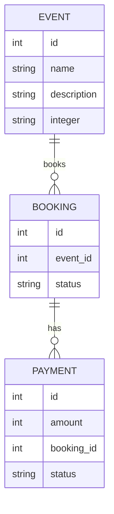

---
# You can also start simply with 'default'
theme: seriph
# random image from a curated Unsplash collection by Anthony
# like them? see https://unsplash.com/collections/94734566/slidev
background: https://cover.sli.dev
# some information about your slides (markdown enabled)
title: Monolith To Microservices
# apply unocss classes to the current slide
class: text-center
# https://sli.dev/features/drawing
drawings:
  persist: false
# slide transition: https://sli.dev/guide/animations.html#slide-transitions
transition: slide-left
# enable MDC Syntax: https://sli.dev/features/mdc
mdc: true
# take snapshot for each slide in the overview
overviewSnapshots: true
---

# Monolith to Microservices

Prasetyo Wicaksono

<div class="abs-br m-6 flex gap-2">
  <a href="https://github.com/praswicaksono/" target="_blank" alt="GitHub" title="Visit Github"
    class="text-xl slidev-icon-btn opacity-50 !border-none !hover:text-white">
    <carbon-logo-github />
  </a>
  <a href="https://id.linkedin.com/in/pwicaksono" target="_blank" alt="Linkedin" title="Visit Linkedin"
    class="text-xl slidev-icon-btn opacity-50 !border-none !hover:text-white">
    <carbon-logo-linkedin />
  </a>
</div>

---
transition: fade-out
---

# Requirement

- PHP 8.3+
- Docker
- Unix Shell (Windows WSL/Unix OS)
- Devbox https://www.jetify.com/devbox

---
transition: fade-out
---

# Goal

- Create simple monolith application
- Refactor
- Setup Microservice Architecture
- Migrate monolith application gradually
- Complete migration

---
transition: fade-out
layout: two-cols
layoutClass: gap-16
---

# Handson: ERD



::right::

# Handson: Endpoint

- /event/book -> book an event, decreate event quota
- /event/cancel -> cancel booking, increase event quota
- /event/pay -> pay an event & update booking status to accepted

Booking Status Enum

- Pending
- Accepted
- Rejected

Payment Status Enum

- Pending
- Paid

---
transition: fade-out
---

# Motivation

- Is your app slow? ❌
- Is your code hard to manage? ❌
- Is your app hard to scale? ❌
- Is your team grow bigger? ✅

---
transition: fade-out
layout: two-cols
layoutClass: gap-16
---

# Benefit

- Fully decoupled service 👍
- Fault tolerant/isolation 👍
- Quicker deploy time 👍
- Enhance productivity 👍

::right::

# Disadvantage

- Overcomplicated 👎
- Hard to Debug 👎
- Versioning 👎
- Latency 👎

---
transition: fade-out
---

# Preparation

- Add static analyzer
- Add code style fixer
- Decouple your code from framework
- At least 90% test coverage
- CI/CD Works
- Add APM (Application Performance Management)
- No more slow query or slow endpoint

---
transition: fade-out
---

# Static Analyzer

- To ensure code quality standarize accross team member, make your code as static as possible.
- To catch bug earlier right in front of IDE.

```bash
composer require --dev phpstan/phpstan
```

```yaml {all|3}
# phpstan.neon.dist
parameters:
    level: 1
    paths:
        - src
        - tests
```

---
transition: fade-out
---

# Code style fixer

- To ensure code style consistent accross team member

```bash
composer require laravel/pint --dev
```

```bash
./vendor/bin/pint --preset psr12
```

---
transition: fade-out
---

# Decouple Your Code From Framework

- Make your code more portable, easier to plugin to another framework
- Easier to decouple entirely from main application

## SOLID Principle

- Single Responsibility Principle
- Open Closed Principle
- Lizkov Subtitution Principle
- Interface Segregation Principle
- Dependency Inversion Principle

---
transition: fade-out
---

# Single Responsibility Principle

````md magic-move {lines: true}
```php {*|2|8}
class UserManager {
    public function createUser($name, $email) {
        echo "User $name with email $email created.\n";

        $this->sendEmail($email, "Welcome", "Thank you for registering!");
    }

    private function sendEmail($to, $subject, $message) {
        echo "Email sent to $to with subject '$subject'.\n";
    }
}

$userManager = new UserManager();
$userManager->createUser("John Doe", "john@example.com");
```

```php {*|1|15}
class UserManager {
    private $emailService;

    public function __construct(EmailService $emailService) {
        $this->emailService = $emailService;
    }

    public function createUser($name, $email) {
        echo "User $name with email $email created.\n";

        $this->emailService->sendEmail($email, "Welcome", "Thank you for registering!");
    }
}

class EmailService {
    public function sendEmail($to, $subject, $message) {
        echo "Email sent to $to with subject '$subject'.\n";
    }
}

$emailService = new EmailService();
$userManager = new UserManager($emailService);
$userManager->createUser("John Doe", "john@example.com");
```
````

---
transition: fade-out
---

# Open Closed Principle

```php
interface Shape {
    public function area(): float;
}

class Circle implements Shape {
    private $radius;
    public function __construct(float $radius) { $this->radius = $radius; }
    public function area(): float { return pi() * $this->radius ** 2; }
}

class Rectangle implements Shape {
    private $width, $height;
    public function __construct(float $width, float $height) { $this->width = $width; $this->height = $height; }
    public function area(): float { return $this->width * $this->height; }
}

function calculateTotalArea(array $shapes): float {
    return array_reduce($shapes, fn($carry, $shape) => $carry + $shape->area(), 0);
}

$shapes = [new Circle(5), new Rectangle(4, 6)];
echo "Total Area: " . calculateTotalArea($shapes);
```

---
transition: fade-out
---

# Lizkov Subtitution Principle

```php
class Bird {
    public function fly(): string {
        return "Flying";
    }
}

class Sparrow extends Bird {
    // Inherits the fly method from Bird
}

class Penguin extends Bird {
    public function fly(): string {
        return "Penguins can't fly";
    }
}
```
---
transition: fade-out
---

# Interface Segregation Principle

````md magic-move {lines: true}
```php
interface Bird {
    public function fly(): string;
     public function swim(): string;
}

class Sparrow implements Bird {
    public function fly(): string {
        return "Sparrow flying";
    }
    public function swim(): string {
        return "Sparrow cant swimming";
    }
}

class Penguin implements Bird {
    public function fly(): string {
        return "Pinguin cant flying";
    }
    public function swim(): string {
        return "Penguin swimming";
    }
}
```

```php
interface Bird {}

interface Flyable extends Bird {
    public function fly(): string;
}

interface Swimmable extends Bird {
    public function swim(): string;
}

class Sparrow implements Flyable {
    public function fly(): string {
        return "Sparrow flying";
    }
}

class Penguin implements Swimmable {
    public function swim(): string {
        return "Penguin swimming";
    }
}
```
````

---
transition: fade-out
---

# Dependency Inversion Principle

````md magic-move {lines: true}
```php {*|20}
interface Logger {
    public function log(string $message);
}

class FileLogger implements Logger {
    public function log(string $message) {
    }
}

class DatabaseLogger implements Logger {
    public function log(string $message) {
    }
}

class UserService {
    public function __construct() {
    }

    public function registerUser(string $username) {
        $logger = new FileLogger();
        $logger->log("User $username registered.");
    }
}
```

```php
interface Logger {
    public function log(string $message);
}

class FileLogger implements Logger {
    public function log(string $message) {
    }
}

class DatabaseLogger implements Logger {
    public function log(string $message) {
    }
}

class UserService {
    private $logger;

    public function __construct(Logger $logger) {
        $this->logger = $logger;
    }

    public function registerUser(string $username) {
        $this->logger->log("User $username registered.");
    }
}
```
````

---
transition: fade-out
---

# Minimum 90% Test Coverage

- Make sure your code are automated tested at least functionally.
- Once you have decoupled your code from framework, you can start implement unit test and make sure have minimum 90% line coverage.

---
transition: fade-out
---

# CI & CD

- Always run automated test, static analyzer and code style fixed for each PR or commit
- Setup automation for deployment and rollback strategy


---
transition: fade-out
---

# Add APM

- Invest in APM such as Newrelic, Datadog or OpenTelemetry to monitor your application performance
- Make sure there are no slow query or slow endpoint before migrating to microservice

---
transition: fade-out
---

# Whats Next?

- Decide which microservice pattern that we are going to use?
- Decide how code will be managed, split each service to individual repo or keep them as one repo?
- Decide which protocol are going to be used?

---
transition: fade-out
---

# Api Gateway Pattern

- Single entry point
- Combination of monolith and microservice
- Gradually convert monolith to microservice
- Can act as load balancer

---
transition: fade-out
---

# Shared Database Architecture

- Easier to implement
- Can convert to 1 DB 1 Service later
- Only focus to migrate code

---
transition: fade-out
---

# Monorepo

- Easier to manage
- Whole codebase still in single repo so automaated testing will be easier
- Univied versioning

---
transition: fade-out
layout: two-cols
layoutClass: gap-16
---

# GRPC

- Based on HTTP2
- Support 2 way communication
- Support client and server streaming
- Very fast, popular choice when developing IPC protocol

::right::

# AMQP (RabbitMQ)

- Fully Async
- Reliable

---
transition: fade-out
---

# Handson: Setup Architecture

- API Gateway Using Apache APISIX with Etcd as configuration storage
- RabbitMQ as message broker for async communication
- Proxy traffic to our monolith

---
transition: fade-out
---

# Handson: Convert Service To Microservice

- Create GRPC service for Booking Service using Hyperf Framework
- Setup routing in Apache APISIX
- Create GRPC Service for Payment Service and AMQP producer
- Set AMQP consumer in Booking Service
